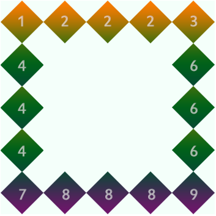
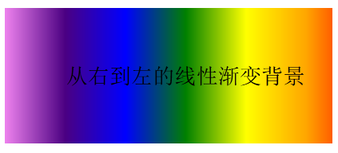

# CSS3 入门学习
## 第一章 初识CSS3
### 1.1 什么是CSS3
CSS3是CSS2的升级版本，3只是版本号，它在CSS2.1的基础上增加了很多强大的新功能。 目前主流浏览器chrome、safari、firefox、opera、甚至360都已经支持了CSS3大部分功能了，IE10以后也开始全面支持CSS3了。

| 前缀        | 浏览器 |
| --------   | -----: |
| -webkit    | chrome和safari |
| -moz       |   firefox  |
| -ms        |    IE   |
| -o         |   opera  |

### 1.2 CSS3可以做什么

**选择器**
以前我们通常用class、 ID 或 tagname 来选择HTML元素，CSS3的选择器强大的难以置信。它们可以减少在标签中的class和ID的数量更方便的维护样式表、更好的实现结构与表现的分离。

**圆角效果**
以前做圆角通常使用背景图片，或繁琐的元素拼凑，现在很简单了 border-radius 帮你轻松搞定

**块阴影与文字阴影**
可以对任意的DIV和文字增加投影效果

**色彩**
CSS3支持更多的颜色和更广泛的颜色定义。新颜色CSS3支持HSL，CMYK，HSLA和RGBA。

**渐变效果**
以前只能用Photoshop做出的图片渐变效果，现在可以用CSS写出来了。IE中滤镜也可以实现。

**个性化字体**
使用`@Font-Face`可以轻松实现定制字体。

**多背景图**
一个元素添加多层背景图片。

**边框背景图**
边框应用背景图片。

**变形处理**
可以对HTML元素进行旋转、缩放、倾斜、移动甚至以前只能用JavaScript实现的强大动画。

**多栏布局**
可以让你不用使用多个div标签就能实现多栏布局。浏览器解释这个属性并生成多栏，让文本实现一个仿报纸的多栏结构

**媒体查询**
针对不同的屏幕分辨率，应用不同的样式。

## 第二章 边框

### 2.1 圆角效果 **border-radius**

**border-radius是向元素添加圆角边框**

**使用方法**

``` css
border-radius: 10px;	/* 所有角都使用半径为10px的圆角 */

border-radius: 5px 4px 3px 2px;	/* 四个半径值分别是左上角、右上角、右下角和左下角，顺时针 */
```

不要以为`border-radius`的值只能用`px`单位，你还可以用**百分比**或者**em**，但是兼容性目前还不是很好。

**实心上半圆**

> 方法：把高度(height)设为宽度(width)的一半，并且只设置为左上角和右上角的半径和元素的高度一致(大于也是可以的)。

```css
div {
	height: 50px;	/* 是width的一半 */
	width: 100px;
	background: #9da;
	border-radius: 50px 50px 0 0;	/* 半径至少设置为height的值 */
}
```

**实心圆**

> 方法：把宽度（width）与高度(height)值设置为一致（也就是正方形），并且四个圆角值都设置为它们值的一半。

```css
div {
	height: 100px;	/* 与width设置一致 */
	width: 100px;
	background: #9da;
	border-radius: 50px;	/* 四个圆角值都设置为宽度或高度值的一半 */
}
```

### 2.2 阴影 **box-shadow**

`box-shadow` 是向盒子添加阴影。支持添加一个或者多个。

`box-shadow: X轴偏移量 Y轴偏移量 [阴影模糊半径] [阴影扩展半径] [阴影颜色] [投影方式];`

**参数详细**

| 值       | 描述 |
| --------   | -----: |
| X轴偏移量    | 必需，水平阴影的位置，允许负值 |
| Y轴偏移量    | 必需，垂直阴影的位置，允许负值 |
| 阴影模糊半径  | 可选，模糊距离 |
| 投影颜色  | 可选，阴影的颜色。省略默认为黑色 |
| 投影方式  | 可选(设置inset时为内部投影方式，默认外阴影) |

> `inset`可以写在参数的第一个或最后一个，其他位置是无效的。

**为元素设置外阴影**

```css
.box_shadow {
	box-shadow: 4px 2px 6px #333333;
}
```

**为元素设置内阴影**

```css
.box_shadow {
	box-shadow: 4px 2px 6px #333333 inset;
}
```

**添加多个阴影**

```css
.box_shadow {
	box-shadow: 4px 2px 6px #f00, -4px -2px 6px #000, 0px 0px 12px 5px #33CC00 inset;
}
```

**疑惑辨析**

* `阴影模糊半径`和`阴影扩展半径`的区别
**阴影模糊半径**：阴影模糊半径：此参数可选，其值只能是为正值，如果其值为0时，表示阴影不具有模糊效果，其值越大阴影的边缘就越模糊；
**阴影扩展半径**：此参数可选，其值可以是正负值，如果值为正，则整个阴影都延展扩大，反之值为负值时，则缩小；

* `X轴偏移量`和`Y轴偏移量`可以设置为负数
正数为正方向；负数为负方向；

### 2.3 为边框应用图片**border-image**

顾名思义就是为边框应用背景图片

**类似常用的`background`:**
`background: 图片路径 起始位置 平铺方式;`

**`border-image`的语法为：**
`border-image: 图片路径 切割图片的宽度 图片延伸方式`

**参数分析**

| 值       | 描述 |
| --------   | -----: |
| 切割图片的宽度    | 单位为像素，也可以用百分比也可以省略`px`,遵循顺时针的规律来分别设置 |
| 图片延伸方式    | 可选：`round`(平铺), `repeat`(重复), `stretch`(拉伸) |

想象一下：一个矩形，有四个边框。如果应用了边框图片，图片该怎么分布呢？ 图片会自动被切割分成四等分。用于四个边框。

可以理解为它是一个切片工具，会自动把用做边框的图片切割。怎么切割呢？为了方便理解，做了一张特殊的图片，由9个矩形（70 * 70像素）拼成的一张图（210 * 210像素），并标注好序号，是不是像传说中的九宫图，如下


把上图当作边框图片来应用查看结果

```css
#border-image {
	background: #F4FFFA;
	width: 210px;
	height: 210px;
	border: 70px solid #ddd;
	border-image: url(borderimg.png) 70 repeat;
}
```

效果为：



从序号可以看出div的四个角分别对应了背景图片的四个角。而2,4,6,8 被重复。而因为是从四周向中心切割图片的所以，5显示不出来.

## 第三章 颜色相关

### 3.1 RGBA

**RGB是一种色彩标准，是由红(R)、绿(G)、蓝(B)的变化以及相互叠加来得到各式各样的颜色。RGBA是在RGB的基础上增加了控制alpha透明度的参数。**

语法：

```css
color: rgba(R, G, B, A);
```

以上R、G、B三个参数，正整数值的取值范围为：0 - 255。百分数值的取值范围为：0.0% - 100.0%。超出范围的数值将被截至其最接近的取值极限。并非所有浏览器都支持使用百分数值。A为透明度参数，取值在0~1之间，不可为负值。

代码示例：

```css
background-color: rgba(100, 200, 60, 0.5);
```

### 3.2 渐变色彩

**CSS3 Gradient** 分为 **线性渐变(linear)** 和 **径向渐变(radial)** 。由于不同的渲染引擎实现渐变的语法不同，这里我们只针对线性渐变的 W3C 标准语法来分析其用法，其余大家可以查阅相关资料。W3C 语法已经得到了 IE10+、Firefox19.0+、Chrome26.0+ 和 Opera12.1+等浏览器的支持。

语法：

``` css
渐变类型（渐变方向, 渐变颜色）
```

参数分析：

| 值 | 描述 |
|-----|------|
| 渐变类型 | 线性渐变(linear-gradient)， 径向渐变(radial-gradient) |
| 渐变方向 | 可以用"**角度**"的关键词或“**英文**”来表示，缺省为“180 deg”，等同“to bottom” |
| 渐变颜色 | 可以两个或者多个颜色值 |

渐变方向：

| 角度 | 用英文 | 作用 |
|-------|-------|-------|
| 0 deg | to top | 从下向上 |
| 90 deg | to right | 从左到右 |
| 180 deg | to bottom | 从上向下 |
| 270 deg | to left | 从右向左 |
| &nbsp; | to top left | 右下角到左上角 |
| &nbsp; | to top right | 左下角到右上角 |

示例：

```css
background: linear-gradient(to left, red, orange, yellow, green, blue, indigo, violet);flu
```

效果图为：



## 第四章 文字和字体

### 4.1 text-overflow 与 word-wrap

