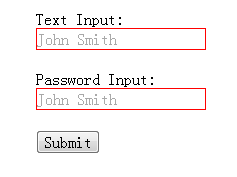
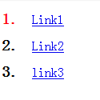
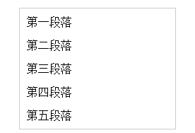

# CSS3 入门学习
## 第一章 初识CSS3
### 1.1 什么是CSS3
CSS3是CSS2的升级版本，3只是版本号，它在CSS2.1的基础上增加了很多强大的新功能。 目前主流浏览器chrome、safari、firefox、opera、甚至360都已经支持了CSS3大部分功能了，IE10以后也开始全面支持CSS3了。

| 前缀        | 浏览器 |
| --------   | -----: |
| -webkit    | chrome和safari |
| -moz       |   firefox  |
| -ms        |    IE   |
| -o         |   opera  |

### 1.2 CSS3可以做什么

**选择器**
以前我们通常用class、 ID 或 tagname 来选择HTML元素，CSS3的选择器强大的难以置信。它们可以减少在标签中的class和ID的数量更方便的维护样式表、更好的实现结构与表现的分离。

**圆角效果**
以前做圆角通常使用背景图片，或繁琐的元素拼凑，现在很简单了 border-radius 帮你轻松搞定

**块阴影与文字阴影**
可以对任意的DIV和文字增加投影效果

**色彩**
CSS3支持更多的颜色和更广泛的颜色定义。新颜色CSS3支持HSL，CMYK，HSLA和RGBA。

**渐变效果**
以前只能用Photoshop做出的图片渐变效果，现在可以用CSS写出来了。IE中滤镜也可以实现。

**个性化字体**
使用`@Font-Face`可以轻松实现定制字体。

**多背景图**
一个元素添加多层背景图片。

**边框背景图**
边框应用背景图片。

**变形处理**
可以对HTML元素进行旋转、缩放、倾斜、移动甚至以前只能用JavaScript实现的强大动画。

**多栏布局**
可以让你不用使用多个div标签就能实现多栏布局。浏览器解释这个属性并生成多栏，让文本实现一个仿报纸的多栏结构

**媒体查询**
针对不同的屏幕分辨率，应用不同的样式。

## 第二章 边框

### 2.1 圆角效果 **border-radius**

**border-radius是向元素添加圆角边框**

**使用方法**

``` css
border-radius: 10px;	/* 所有角都使用半径为10px的圆角 */

border-radius: 5px 4px 3px 2px;	/* 四个半径值分别是左上角、右上角、右下角和左下角，顺时针 */
```

不要以为`border-radius`的值只能用`px`单位，你还可以用**百分比**或者**em**，但是兼容性目前还不是很好。

**实心上半圆**

> 方法：把高度(height)设为宽度(width)的一半，并且只设置为左上角和右上角的半径和元素的高度一致(大于也是可以的)。

```css
div {
	height: 50px;	/* 是width的一半 */
	width: 100px;
	background: #9da;
	border-radius: 50px 50px 0 0;	/* 半径至少设置为height的值 */
}
```

**实心圆**

> 方法：把宽度（width）与高度(height)值设置为一致（也就是正方形），并且四个圆角值都设置为它们值的一半。

```css
div {
	height: 100px;	/* 与width设置一致 */
	width: 100px;
	background: #9da;
	border-radius: 50px;	/* 四个圆角值都设置为宽度或高度值的一半 */
}
```

### 2.2 阴影 **box-shadow**

`box-shadow` 是向盒子添加阴影。支持添加一个或者多个。

`box-shadow: X轴偏移量 Y轴偏移量 [阴影模糊半径] [阴影扩展半径] [阴影颜色] [投影方式];`

**参数详细**

| 值       | 描述 |
| --------   | -----: |
| X轴偏移量    | 必需，水平阴影的位置，允许负值 |
| Y轴偏移量    | 必需，垂直阴影的位置，允许负值 |
| 阴影模糊半径  | 可选，模糊距离 |
| 投影颜色  | 可选，阴影的颜色。省略默认为黑色 |
| 投影方式  | 可选(设置inset时为内部投影方式，默认外阴影) |

> `inset`可以写在参数的第一个或最后一个，其他位置是无效的。

**为元素设置外阴影**

```css
.box_shadow {
	box-shadow: 4px 2px 6px #333333;
}
```

**为元素设置内阴影**

```css
.box_shadow {
	box-shadow: 4px 2px 6px #333333 inset;
}
```

**添加多个阴影**

```css
.box_shadow {
	box-shadow: 4px 2px 6px #f00, -4px -2px 6px #000, 0px 0px 12px 5px #33CC00 inset;
}
```

**疑惑辨析**

* `阴影模糊半径`和`阴影扩展半径`的区别
**阴影模糊半径**：阴影模糊半径：此参数可选，其值只能是为正值，如果其值为0时，表示阴影不具有模糊效果，其值越大阴影的边缘就越模糊；
**阴影扩展半径**：此参数可选，其值可以是正负值，如果值为正，则整个阴影都延展扩大，反之值为负值时，则缩小；

* `X轴偏移量`和`Y轴偏移量`可以设置为负数
正数为正方向；负数为负方向；

### 2.3 为边框应用图片**border-image**

顾名思义就是为边框应用背景图片

**类似常用的`background`:**
`background: 图片路径 起始位置 平铺方式;`

**`border-image`的语法为：**
`border-image: 图片路径 切割图片的宽度 图片延伸方式`

**参数分析**

| 值       | 描述 |
| --------   | -----: |
| 切割图片的宽度    | 单位为像素，也可以用百分比也可以省略`px`,遵循顺时针的规律来分别设置 |
| 图片延伸方式    | 可选：`round`(平铺), `repeat`(重复), `stretch`(拉伸) |

想象一下：一个矩形，有四个边框。如果应用了边框图片，图片该怎么分布呢？ 图片会自动被切割分成四等分。用于四个边框。

可以理解为它是一个切片工具，会自动把用做边框的图片切割。怎么切割呢？为了方便理解，做了一张特殊的图片，由9个矩形（70 * 70像素）拼成的一张图（210 * 210像素），并标注好序号，是不是像传说中的九宫图，如下


把上图当作边框图片来应用查看结果

```css
#border-image {
	background: #F4FFFA;
	width: 210px;
	height: 210px;
	border: 70px solid #ddd;
	border-image: url(borderimg.png) 70 repeat;
}
```

效果为：


从序号可以看出div的四个角分别对应了背景图片的四个角。而2,4,6,8 被重复。而因为是从四周向中心切割图片的所以，5显示不出来.

## 第三章 颜色相关

### 3.1 RGBA

**RGB是一种色彩标准，是由红(R)、绿(G)、蓝(B)的变化以及相互叠加来得到各式各样的颜色。RGBA是在RGB的基础上增加了控制alpha透明度的参数。**

语法：

```css
color: rgba(R, G, B, A);
```

以上R、G、B三个参数，正整数值的取值范围为：0 - 255。百分数值的取值范围为：0.0% - 100.0%。超出范围的数值将被截至其最接近的取值极限。并非所有浏览器都支持使用百分数值。A为透明度参数，取值在0~1之间，不可为负值。

代码示例：

```css
background-color: rgba(100, 200, 60, 0.5);
```

### 3.2 渐变色彩

**CSS3 Gradient** 分为 **线性渐变(linear)** 和 **径向渐变(radial)** 。由于不同的渲染引擎实现渐变的语法不同，这里我们只针对线性渐变的 W3C 标准语法来分析其用法，其余大家可以查阅相关资料。W3C 语法已经得到了 IE10+、Firefox19.0+、Chrome26.0+ 和 Opera12.1+等浏览器的支持。

语法：

``` css
渐变类型（渐变方向, 渐变颜色）
```

参数分析：

| 值 | 描述 |
|-----|------|
| 渐变类型 | 线性渐变(linear-gradient)， 径向渐变(radial-gradient) |
| 渐变方向 | 可以用"**角度**"的关键词或“**英文**”来表示，缺省为“180 deg”，等同“to bottom” |
| 渐变颜色 | 可以两个或者多个颜色值 |

渐变方向：

| 角度 | 用英文 | 作用 |
|-------|-------|-------|
| 0 deg | to top | 从下向上 |
| 90 deg | to right | 从左到右 |
| 180 deg | to bottom | 从上向下 |
| 270 deg | to left | 从右向左 |
| &nbsp; | to top left | 右下角到左上角 |
| &nbsp; | to top right | 左下角到右上角 |

示例：

```css
background: linear-gradient(to left, red, orange, yellow, green, blue, indigo, violet);flu
```

效果图为：


## 第四章 文字和字体

### 4.1 text-overflow 与 word-wrap

`text-overflow`用来设置是否使用一个 **省略标记(...)** 标示对象内文本的溢出。

语法：

```css
text-overflow: clip | ellipsis
```

但是`text-overflow`只是用来说明文字溢出时用什么方式显示，要实现溢出时产生省略号的效果，还须定义强制文本在一行内显示（`white-space:nowrap`）及溢出内容为隐藏（`overflow:hidden`），只有这样才能实现溢出文本显示省略号的效果，代码如下:

```css
text-overflow: ellipsis;
overflow: hidden;
white-space: nowrap;
```

同时，word-wrap也可以用来设置文本行为，当前行超过指定容器的边界时是否断开转行。

语法:

```css
word-wrap: normal | break-word
```

`normal`为浏览器默认值，`break-word`设置在**长单词**或**URL地址**内部进行换行。

### 4.2 嵌入字体 `@font-face`

**`@font-face`能够加载服务器端的字体文件，让浏览器端可以显示用户电脑里没有安装的字体.**

语法：

```css
@font-face {
	font-family: 字体名称;
	src: 字体文件在服务器上的相对路径或绝对路径;
}
```

这样设置后，就可以像普通字体在（font-＊）中设置字体样式。

比如：

```css
p {
	font-size: 12px;
	font-family: "My font";		/* 必须项，设置@font-face中的font-family同样的值 */
}
```

### 4.3 文本阴影 `text-shadow`

`text-shadow` 可以用来设置文本的阴影效果。

语法：

```css
text-shadow: X-Offset Y-Offset blur color;
```

参数分析：

| 值 | 描述 |
|---------|--------|
| X-Offset | 表示阴影的水平偏移距离，其值为正值时阴影向右偏移，反之向左偏移 |
| Y-Offset | 是指阴影的垂直偏移距离，如果其值是正值，阴影向下偏移，反之向上偏移 |
| Blur | 是指阴影的模糊程度，其值不能是负值，如果值越大，阴影越模糊，反之阴影越清晰，如果不需要阴影模糊可以将Blur值设置为0 |
| Color | 是指阴影的颜色，可以使用RGBA色 |


## 第五章 背景样式

### 5.1 backgrond-origin

设置元素背景图片的原始起始位置。

语法： 

```css
background-origin: border-box | padding-box | content-box;
```

参数分别表示背景图片是从 **边框** ，还是 **内边距（默认值）** ，或者是 **内容区域** 开始显示

参数效果如下：


> **Pay attention** 如果背景不是 `no-repeat` ，这个属性无效，它会默认从 **边框** 开始显示.

### 5.2 background-clip

用来将背景图片做适当的**裁剪**以适应实际需要。

语法：

```css
background-clip: border-box | padding-box | content-box | no-clip
```

参数分别从 **边框** 或 **内填充**， 或者 **内容区域** 向外裁剪背景。 `no-clip`表示不裁剪， 和参数`border-box`显示同样的效果。`background-clip`默认值为`border-box`.

效果图为：


### 5.3 background-size

设置背景图片的大小，以**长度值**或**百分比**显示，还可以通过`cover`和`contain`来对图片进行伸缩。

语法：

```css
background-size: auto | <长度值> | <百分比> | cover | contain 
```

参数说明：

| 值 | 描述 |
|-----|-------|
| auto | 默认值，不改变背景图片的原始高度和宽度 |
| <长度值> | 成对出现，如200px 50px ，将背景图片宽高依次设置为前面两个值，当设置一个值时，将其作为图片宽度值来等比缩放 |
| <百分比> | 0%－100%之间的任何值，将背景图片宽高依次设置为所在元素宽高乘以前面百分比得出的数值，当设置一个值时同上|
| cover | 顾名思义为覆盖，即将背景图片等比缩放以填满整个容器 |
| contain | 容纳，即将背景图片等比缩放至某一边紧贴容器边缘为止 |

### 5.4 multiple background

多重背景，也就是CSS2里`background`的属性外加`origin`、`clip`和`size`组成的新`background`的多次叠加，缩写时为用逗号隔开的每组值；用分解写法时，如果有多个背景图片，而其他属性只有一个（例如`background-repeat`只有一个），表明所有背景图片应用该属性值。

语法缩写如下：

```css
background: [background-color] | [background-image] | [background-position][/background-size] | [background-repeat] | [background-attachment] | [background-clip] | [background-origin],...
```

可以把上面的缩写拆分以下形式：

```css
background-image:url1,url2,...,urlN;
background-repeat : repeat1,repeat2,...,repeatN;
backround-position : position1,position2,...,positionN;
background-size : size1,size2,...,sizeN;
background-attachment : attachment1,attachment2,...,attachmentN;
background-clip : clip1,clip2,...,clipN;
background-origin : origin1,origin2,...,originN;
background-color : color;
```

> **Pay Attention**
> 
> 1. 用逗号隔开每组 background 的缩写值；
> 2. 如果有 size 值，需要紧跟 position 并且用 "/" 隔开；
> 3. 如果有多个背景图片，而其他属性只有一个（例如 background-repeat 只有一个），表明所有背景图片应用该属性值。
> 4. `background-color` 只能设置**一个**。


## 第六章 CSS3选择器(上)

### 6.1 属性选择器

在HTML中，通过各种各样的属性可以给元素增加很多附加的信息。例如，通过id属性可以将不同div元素进行区分。

在CSS2中引入了一些属性选择器，而CSS3在CSS2的基础上对属性选择器进行了扩展，新增了3个属性选择器，使得属性选择器有了通配符的概念，这三个属性选择器与CSS2的属性选择器共同构成了CSS功能强大的属性选择器。如下表所示：

| 属性选择器 | 功能描述 |
|----------|---------|
| E[att^="val"] | 选择匹配元素E，且E元素定义了属性`att`，其属性值以`val`开头的任何字符串 |
| E[att$="val"] | 选择匹配元素E，且E元素定义了属性`att`，其属性值以`val`结尾的任何字符串 |
| E[att*="val"] | 选择匹配元素E，且E元素定义了属性`att`，其属性值任意位置包含了`val`，换句话说，这符串与属性中的任何位置相匹配|

### 6.2 结构性伪类选择器 —— root

`:root`选择器，从字面上我们就可以很清楚的理解是**根选择器**，他的意思就是匹配元素E所在文档的根元素。在HTML文档中，根元素始终是`<html>`。

推荐使用`:root`代替`html`标签进行样式的定义。

### 6.3 结构性伪类选择器 —— not

`:not`选择器称为**否定选择器**，和jQuery中的`:not`选择器一模一样，**可以选择除某个元素之外的所有元素**。就拿form元素来说，比如说你想给表单中除submit按钮之外的input元素添加红色边框，CSS代码可以写成：

```css
form {
	width: 200px;
	margin: 20px auto;
}
div {
	margin-bottom: 20px;
}
input:not([type="submit"]){
	border: 1px solid red;
}
```

相关的html代码：

```html
<form action="#">
  	<div>
    	<label for="name">Text Input:</label>
    	<input type="text" name="name" id="name" placeholder="John Smith" />
  	</div>
  	<div>
    	<label for="name">Password Input:</label>
    	<input type="text" name="name" id="name" placeholder="John Smith" />
  	</div>
  	<div>
    	<input type="submit" value="Submit" />
  	</div>
</form>
```

效果为：



### 6.4 结构性伪类选择器 —— empty

`:empty`选择器表示的就是空。用来选择没有任何内容的元素，这里没有内容指的是一点内容都没有，**哪怕是一个空格**。

示例：

你的文档中有三个段落p元素，你想把没有任何内容的P元素隐藏起来。我们就可以使用`:empty`选择器来控制。

html代码：

```html
<p>我是一个段落</p>
<p> </p>
<p></p>​
```

css代码：

```css
p{
 	background: orange;
 	min-height: 30px;
}
p:empty {
  	display: none;
}​
```

效果为：


### 6.5 结构性伪类选择器 —— target

`:target`选择器称为目标选择器，用来匹配文档(页面)的**url的某个标志符的目标元素**。我们先来上个例子，然后再做分析。

示例：

点击链接显示隐藏段落

html代码：

```html
<h2><a href="#brand">Brand</a></h2>
<div class="menuSection" id="brand">
	content for Brand
</div>
```

css代码：

```css
.menuSection{
  	display: none;
}
:target{	/*这里的:target就是指id="brand"的div对象*/
  	display:block;
}
```

结果为：


分析：

* 具体来说，触发元素的URL中的标志符通常会包含一个#号，后面带有一个标志符名称，上面代码中是：`#brand`
* `:target`就是用来匹配`id`为`brand`的元素（`id="brand"`的元素）,上面代码中是那个div元素。

多个URL（多个target）处理：

就像上面的例子，`#brand`与后面的`id="brand"`是对应的，当同一个页面上有很多的url的时候你可以取不同的名字，只要#号后对的名称与`id=""`中的名称对应就可以了.

示例：

html代码：

```html
<h2><a href="#brand">Brand</a></h2>
<div class="menuSection" id="brand">
  	content for Brand
</div>
<h2><a href="#jake">Brand</a></h2>
<div class="menuSection" id="jake">
 	content for jake
</div>
<h2><a href="#aron">Brand</a></h2>
<div class="menuSection" id="aron">
	content for aron
</div>
```

css代码：

```css
#brand:target {
  	background: orange;
  	color: #fff;
}
#jake:target {
  	background: blue;
  	color: #fff;
}
#aron:target {
  	background: red;
  	color: #fff;
}
```

### 6.6 结构性伪类选择器 —— first-child

`:first-child`选择器表示的是选择父元素的第一个子元素的元素E。简单点理解就是选择元素中的`第一个子元素`，记住是子元素，而不是后代元素

示例：

通过`:first-child`选择器定位列表中的第一个列表项，并将序列号颜色变为红色。

html代码：

```html
<ol>
  	<li><a href="##">Link1</a></li>
  	<li><a href="##">Link2</a></li>
  	<li><a href="##">link3</a></li>
</ol>
```

css代码：

```css
ol > li{
  	font-size:20px;
  	font-weight: bold;
  	margin-bottom: 10px;
}

ol a {
  	font-size: 16px;
  	font-weight: normal;
}

ol > li:first-child{
  	color: red;
}
```

效果为：



### 6.7 结构性伪类选择器 —— last-child

`:last-child`选择器与`:first-child`选择器作用类似，不同的是`:last-child`选择器选择的是元素的最后一个子元素。

示例：

在博客的排版中，每个段落都有`15px`的`margin-bottom`，假设不想让博客`post`中最后一个段落不需要底部的`margin`值，可以使用`:last-child`选择器。

html代码：

```html
<div class="post">
  	<p>第一段落</p>
  	<p>第二段落</p>
  	<p>第三段落</p>
  	<p>第四段落</p>
  	<p>第五段落</p>
</div>​
```

css代码：

```css
.post {
  	padding: 10px;
  	border: 1px solid #ccc;
  	width: 200px;
  	margin: 20px auto;
}
.post p {
  	margin:0 0 15px 0;
}

.post p:last-child {
  	margin-bottom:0;
}
```

效果为：



### 6.8 结构性伪类选择器 —— nth-child(n)

`:nth-child(n)`选择器用来定位某个父元素的一个或多个特定的子元素。其中`n`是其参数，而且可以是整数值(1,2,3,4)，也可以是表达式(2n+1、-n+5)和关键词(odd(奇数)、even（偶数）)，但参数n的起始值始终是1，而不是0。也就是说，参数n的值为0时，选择器将选择不到任何匹配的元素。

> **经验与技巧** &nbsp; &nbsp;当`:nth-child(n)`选择器中的`n`为一个表达式时，其中`n`是从`0`开始计算，当表达式的值为0或小于0的时候，不选择任何匹配的元素。

示例：

通过`:nth-child(n)`选择器，并且参数使用表达式`2n`，将偶数行列表背景色设置为橙色。

html代码：

```html
<ol>
  	<li>item1</li>
  	<li>item2</li>
  	<li>item3</li>
  	<li>item4</li>
  	<li>item5</li>
  	<li>item6</li>
  	<li>item7</li>
  	<li>item8</li>
  	<li>item9</li>
  	<li>item10</li>
</ol>​
```

css代码：

```css
ol > li:nth-child(2n){
  	background: orange;
}
```

效果为：

.png)

### 6.9 结构性伪类选择器 —— nth-last-child(n)

`:nth-last-child(n)`选择器和前面的`:nth-child(n)`选择器非常的相似，只是这里多了一个`last`，所起的作用和`:nth-child(n)`选择器有所区别，从某父元素的最后一个子元素开始计算，来选择特定的元素。

示例：

选择列表中倒数第五个列表项，将其背景设置为橙色。

html 代码：

```html
<ol>
  	<li>item1</li>
  	<li>item2</li>
  	<li>item3</li>
  	<li>item4</li>
  	<li>item5</li>
  	<li>item6</li>
  	<li>item7</li>
  	<li>item8</li>
  	<li>item9</li>
  	<li>item10</li>
  	<li>item11</li>
  	<li>item12</li>
  	<li>item13</li>
  	<li>item14</li>
  	<li>item15</li>
</ol>​
```

css代码：

```css
ol > li:nth-last-child(5){
  	background: orange;
}
```

效果为：

.png)

### 6.10 first-of-type选择器

`:first-of-type`选择器类似于`:first-child`选择器，不同之处就是指定了元素的类型,其主要用来定位一个父元素下的某个类型的第一个子元素。

示例：

通过`:first-of-type`选择器，定位div容器中的第一个p元素（p不一定是容器中的第一个子元素），并设置其背景色为橙色。

html代码：

```html
<div class="wrapper">
  	<div>我是一个块元素，我是.wrapper的第一个子元素</div>
  	<p>我是一个段落元素，我是不是.wrapper的第一个子元素，但是他的第一个段落元素</p>
  	<p>我是一个段落元素</p>
  	<div>我是一个块元素</div>
</div>
```

css代码：

```css
.wrapper {
  	width: 500px;
  	margin: 20px auto;
  	padding: 10px;
  	border: 1px solid #ccc;
  	color: #fff;
}
.wrapper > div {
  	background: green;
}
.wrapper > p {
  	background: blue;
}
/* 我要改变第一个段落的背景为橙色 */
.wrapper > p:first-of-type {
  	background: orange;
}
```

效果为：


### 6.11 nth-of-type(n)选择器

`:nth-of-type(n)`选择器和`:nth-child(n)`选择器非常类似，不同的是它只计算父元素中指定的某种类型的子元素。当某个元素中的子元素不单单是同一种类型的子元素时，使用`:nth-of-type(n)`选择器来定位于父元素中某种类型的子元素是非常方便和有用的。在`:nth-of-type(n)`选择器中的`n`和`:nth-child(n)`选择器中的`n`参数也一样，可以是具体的整数，也可以是表达式，还可以是关键词。

示例：

通过`:nth-of-type(2n)`选择器，将容器`div.wrapper`中偶数段数的背景设置为橙色。

html代码：

```html
<div class="wrapper">
  	<div>我是一个Div元素</div>
  	<p>我是一个段落元素</p>
  	<div>我是一个Div元素</div>
  	<p>我是一个段落</p>
  	<div>我是一个Div元素</div>
  	<p>我是一个段落</p>
  	<div>我是一个Div元素</div>
  	<p>我是一个段落</p>
  	<div>我是一个Div元素</div>
  	<p>我是一个段落</p>
  	<div>我是一个Div元素</div>
  	<p>我是一个段落</p>
  	<div>我是一个Div元素</div>
  	<p>我是一个段落</p>
  	<div>我是一个Div元素</div>
  	<p>我是一个段落</p>
</div>
```

css代码：

```css
.wrapper > p:nth-of-type(2n){
  	background: orange;
}
```

效果为：

.png)

### 6.12 last-of-type 选择器

`:last-of-type`选择器和`:first-of-type`选择器功能是一样的，不同的是他选择是父元素下的某个类型的`最后一个子元素`。

示例：

通过`:last-of-type`选择器，将容器`div.wrapper`中最后一个段落元素背景设置为橙色

html代码：

```html
<div class="wrapper">
	<p>我是第一个段落</p>
	<p>我是第二个段落</p>
	<p>我是第三个段落</p>
	<div>我是第一个Div元素</div>
	<div>我是第二个Div元素</div>
	<div>我是第三个Div元素</div>
</div>
```

css代码

```css
.wrapper > p:last-of-type {
	background: orange;
}
```

效果图：


### 6.13 nth-last-of-type(n)选择器

`:nth-last-of-type(n)`选择器和`:nth-of-type(n)`选择器是一样的，选择父元素中指定的某种子元素类型，但它的起始方向是从最后一个子元素开始，而且它的使用方法类似于上节中介绍的`:nth-last-child(n)`选择器一样。

示例：

通过`:nth-last-of-type(n)`选择器将容器`div.wrapper`中的倒数第三个段落背景设置为橙色。

html代码：

```html
<div class="wrapper">
  	<p>我是第一个段落</p>
  	<p>我是第二个段落</p>
  	<p>我是第三个段落</p>
  	<p>我是第四个段落</p>
  	<p>我是第五个段落</p>
  	<div>我是一个Div元素</div>
  	<p>我是第六个段落</p>
  	<p>我是第七个段落</p>
</div>
```

css代码：

```css
.wrapper > p:nth-last-of-type(3) {
	background: orange;
}
```

结果为：


### 6.14 only-child 选择器

`:only-child`选择器选择的是父元素中只有一个子元素，而且只有唯一的一个子元素。也就是说，匹配的元素的父元素中仅有一个子元素，而且是一个`唯一的子元素`。

示例：

通过`:only-child`选择器，来控制仅有一个子元素的背景样式，为了更好的理解，我们这个示例通过对比的方式来向大家演示。

html代码：

```html
<div class="post">
  	<p>我是一个段落</p>
  	<p>我是一个段落</p>
</div>
<div class="post">
  	<p>我是一个段落</p>
</div>
```

css代码：

```css
.post p {
  	background: green;
  	color: #fff;
  	padding: 10px;
}
.post p:only-child {
  	background: orange;
}
```

效果为：


### 6.15 only-of-type 选择器

`:only-of-type`选择器用来选择一个元素是它的父元素的唯一一个相同类型的子元素。这样说或许不太好理解，换一种说法。`:only-of-type`是表示一个元素他有很多个子元素，而其中只有一种类型的子元素是唯一的，使用`:only-of-type`选择器就可以选中这个元素中的唯一一个类型子元素。

示例：

通过`:only-of-type`选择器来修改容器中仅有一个div元素的背景色为橙色。

html 代码：

```html
<div class="wrapper">
  	<p>我是一个段落</p>
  	<p>我是一个段落</p>
  	<p>我是一个段落</p>
  	<div>我是一个Div元素</div>
</div>
<div class="wrapper">
  	<div>我是一个Div</div>
  	<ul>
  		<li>我是一个列表项</li>
  	</ul>
  	<p>我是一个段落</p>
</div>
```

css代码：

```css
.wrapper > div:only-of-type {
	background: orange;
}
```

结果：


## 第七章 CSS3 选择器(下)


