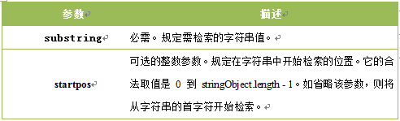
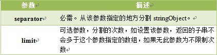

## 1. 条件语句
1. if条件语句
2. if...else
3. if...else if...else
4. switch 语句

## 2. 循环语句
1. for
2. while
3. do...while
4. break
5. continue

## 3. 事件
| 事件 | 说明 |
|---------|---------|
| onclick | 鼠标点击 |
| onmouseover | 鼠标悬浮 |
| onmouseout | 鼠标离开 |
| onchange | 文本框内容改变 |
| onselect | 文本框内容被选中 |
| onblur | 光标离开 |
| onfocus | 光标聚集 |
| onload | 网页导入 |
| onunload | 关闭网页 |

## 4. 对象
> JavaScript 中的所有事物都是对象，如:字符串、数值、数组、函数等，每个对象带有属性和方法。

**对象的属性**:反映该对象某些特定的性质的，如：字符串的长度、图像的长宽等

**对象的方法**:能够在对象上执行的动作.

* 访问对象属性的语法：`ObjectName.propertyName`
* 访问对象方法的语法：`ObjectName.methodName()`

### 4.1. Date 日期对象

语法：`var date = new Date();`

`date`成为了日期对象，并且有了当前时间作为初始值；

如果自定义初始值有如下方法：

```js
var date = new Date(2012, 10, 1);	// 2012年10月1日
var date = new Date('Oct 1, 2012'); // 2012年10月1日
```

**访问方法语句：** `<日期对象><方法>`

Date对象中处理时间和日期的常用方法为：


### 4.2. String 字符串对象

#### 4.2.1 返回该字符串的长度 `length`

> 语法

`stringObject.length`

#### 4.2.2 返回字符串转化大写或小写后的字符串 `toUpperCase()/toLowerCase()`

> 语法

`stringObject.toUpperCase()/stringObject.toLowerCase()` 

#### 4.2.3 返回指定位置的字符 `charAt()`

> 语法

`stringObject.charAt(index)`

`index`参数必须，表示字符串中某个位置的数字，即字符串中的下标(下标从0开始)。

> 注意：如果`index`不在`0`到`string.length-1`之间,则返回一个空字符串。

#### 4.2.4 返回指定的字符串首次出现的位置 `indexOf()`

`stringObject.indexOf(substring, startpos)`

> 参数说明



> 说明

1. 该方法将从头到尾地检索字符串 `stringObject`，看它是否含有子串 `substring`。
2. 可选参数，从`stringObject`的`startpos`位置开始查找`substring`，如果没有此参数将从`stringObject`的开始位置查找。
3. 如果找到一个 `substring`，则返回 `substring` 的第一次出现的位置。`stringObject` 中的字符位置是从 `0` 开始的。

> 注意

1. `indexOf()` 方法区分大小写。
2. 如果要检索的字符串值没有出现，则该方法返回 `-1`。

> 例子

例如: 对 "I love JavaScript!" 字符串内进行不同的检索：

```js
<script type="text/javascript">
  var str="I love JavaScript!"
  document.write(str.indexOf("I") + "<br />");
  document.write(str.indexOf("v") + "<br />");
  document.write(str.indexOf("v",8));
</script>
```

以上代码结果为：

``` console
0
4
9
```

#### 4.2.5 返回分割数组 `split()`

`stringObject.split(separator,limit)`

> 参数说明



> 注意

如果把空字符串 `("")` 用作 separator，那么 `stringObject` 中的每个字符之间都会被分割。

> 例子

使用指定符号分割字符串，代码如下:

```js
var mystr = "www.imooc.com";
document.write(mystr.split(".")+"<br>");
document.write(mystr.split(".", 2)+"<br>");
```

运行结果:

```console
www,imooc,com
www,imooc
```
