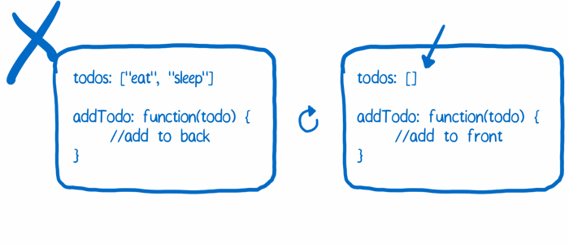

# 一个介绍REDUX的漫画(译)
[点击查看原文](https://code-cartoons.com/a-cartoon-intro-to-redux-3afb775501a6#.1iu99fosz)

关于Flux与一个受到Flux启发而产生的模式Redux之间的差异，造成了本身比认识Flux更具迷茫性。在这篇文章中我将解析两者间的差异。

## 为什么改变 Flux ?

Redux 解决了 Flux 遗留下来的一些问题，当然，也增加了另外的一些问题。

就像 Flux 一样，Redux 使得App中 状态的改变是可以预知的。如果你希望改变这些状态，就必须发出(fire off)一个action。 没有其他的途径去直接改变状态是因为状态的拥有者(即store)只有getter, 没有setter. 这些Flux的基础和Redux十分相似。

那么为什么需要这个不同的模式呢？Redux的创作者认为这是一个去改善Flux的机会。他渴望更好的开发工具。他认为当你到达一定的程度时，你希望可以创造更好的开发者工具，尽管Flux已经给了你相同的可预测性。

他希望使用热更新和[time travel debugging](https://code-cartoons.com/hot-reloading-and-time-travel-debugging-what-are-they-3c8ed2812f35#.62a9llk9j)。但是这些问题在Flux实现很困难。

### 问题1: store 的代码无法重新加载除非你擦除(wipe out)状态。
在Flux的store中包含两件事：
- 状态修改逻辑
- 当前的状态

这两件事情在同一个对象里面进行就是造成热加载的问题所在。当你重新加载store中的对象去观察新的状态改变逻辑的影响时，你会丢失当前store中保持的状态。另外，你也会陷入对于将store绑定在其余系统的事件描述的混乱中。

### 解决方案：
